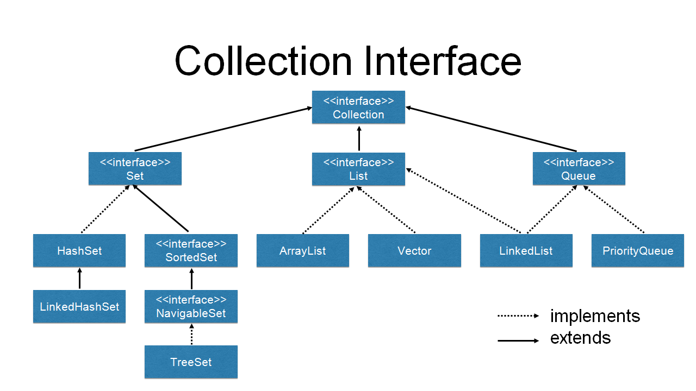

# String

String 为字符串类 在Java中是引用类型
String 底层为char数组 所以String很多特性都是数组的特性 例如String由length()方法保存长度
字符串一旦确定 不能修改

## 构造方法

- 字符数组转字符串
  `new String(char[])`
- 字节数组转字符串
  `new String(byte[])`
  - 选取字节数组位置转字符串
    `new String(byte[],index,last)`

## 常用方法

- `indexOf()`
  从头查找某字符的索引 找不到返回-1
- `lastIndexOf()`
  从尾查找某字符的索引 找不到返回-1
- `charAt()`
  获取字符串中索引处的字符
- `trim()`
  去除字符串中两边的空格
- `startsWith()`
  判断是否以指定字符串开头
- `endsWith()`
  判断是否以指定字符串结尾
- `toUpperCase()`
  转大写
- `toLowerCase()`
  转小写
  截取字符串
- `toCharArray()`
  转字符数组
- `getBytes()`
  转字节数组
- `replace()`
  替换
  - `replaceAll()`
    包含正则表达式的替换
- `split()`
  以指定字符串分割为字符串数组
- `equalsIgnoreCase()`
  不区分大小写比较

# StringBuffer/StringBuilder

`StringBuffer`线程安全 多线程环境下不会出现问题
`StringBuilder`线程不安全 多线程环境下可能出现问题

## 常用方法

- `append()`
  字符串拼接
- `capacity()`
  获取容量

# 包装类

装箱 自动将基本数据类型转换为包装器类型 
拆箱 自动将包装器类型转换为基本数据类型

| 基本类型 | 封装类型  |
| -------- | --------- |
| byte     | Byte      |
| char     | Character |
| short    | Short     |
| int      | Integer   |
| long     | Long      |
| float    | Float     |
| double   | Double    |
| boolean  | Boolean   |

## 相互转换

## 自动装箱和自动拆箱

## 深入整型常量池

# System

`public static long currentTimeMillis()`
  用来返回当前时 间与1970年1月1日0时0分0秒之间以毫秒为单位的时间差 此方法适于计算时间差。

`System`类代表系统，系统级的很多属性和控制方法都放置在该类的内部。 该类位于`java.lang`包。
由于该类的构造器是`private`的，所以无法创建该类的对象，也就是无法实 例化该类。其内部的成员变量和成员方法都是`static`的，所以也可以很方便的进行调用。

## 成员变量
System类内部包含`in`、`out`和`err`三个成员变量，分别代表标准输入流(键盘输入)，标准输出流(显示器)和标准错误输出流(显示器)。

# Throwable

# Error

系统内部错误 这类错误由系统进行处理 程序本身无需处理

- OOM(内存溢出错误)
- VirtualMachineError(虚拟机错误)
- StackOverflowError(堆栈溢出错误)

一般发生这种情况，JVM会选择终止程序

# Exception

`Exception` 是所有异常类的父类

`printStackTrace()` 打印错误的追踪栈帧
`getMessage()` 获取错误信息

## 分类

- RuntimeException
  指程序编译时需要捕获或处理的异常，如IOException、自定义异常等。属于checked异常
- 非RuntimeException  
  指程序编译时不需要捕获或处理的异常，如：NullPointerException等。属于unchecked异常。一般是由程序员粗心导致的。如空指针异常、数组越界、类型转换异常等

# try catch

处理异常

1.7 新特性 自动关闭资源

```java
try(资源打开语句;可以写多个){
  高风险语句
} catch(异常类型){

}
```

可以写多个`catch` 但是从上到下必须是从子类到父类 或者没有继承关系

# throws

抛出异常  提醒机制

一般在服务端使用`throws`。在客户端使用`try catch`
服务端就是被调用的 客户端就是调用处

# fianlly

必须执行的语句块 不能单独使用 必须和`try` `try...catch...`一同使用

只有在执行`System.exit(0)`后`finally`才不会执行

## 不能有比原方法有更宽泛的异常

方法重写不能比原方法有更宽泛的异常

# 自定义异常

一般需要提供无参构造以及有参构造 用于把异常信息传递给父类

## throw

异常起点

```java

class MyException extends Exception{
  public MyException(){

  }
  public MyException(String msg){
    super(msg);
  }
}

public class Test{
  public static void main(String[] args){
    // 创建异常并结合throws抛出
    throw new MyException();
  }
}
```

# Collection

- add()
- addAll()
- remove()
- removeAll()
- clear()
- isEmpty()
- contains()

contains和remove都会调用equals方法

如果集合中存放基本数据类型 一定要将其装箱为基本类型包装类

**没有提供修改和查询的方法**



# iterator

迭代器

主要做遍历操作 使用迭代器可以屏蔽数据结构之间的差异性

- hasNext()
- next()
- remove()

迭代器一旦生成 集合将不能被修改 否则需要重新生成迭代器

## 增强for循环

迭代器的简写方式 同样不能删除

# List

有序 可重复

## ArrayList

底层为Object数组 查询修改效率高

- add(index,items)
- set(index,items)
- size()

## LinkedList

底层为双向链表 随机添加和删除效率高

- add(index,items)
- set(index,items)
- size()

# Set

无序 不可重复 不能保证数据的添加和取出顺序一致