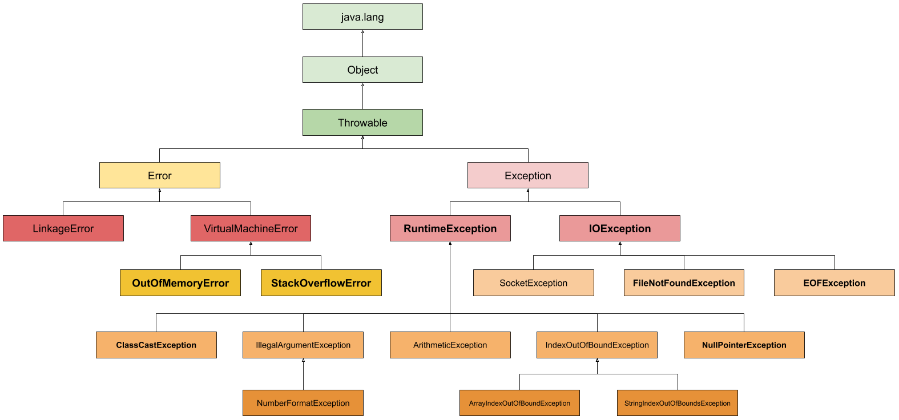
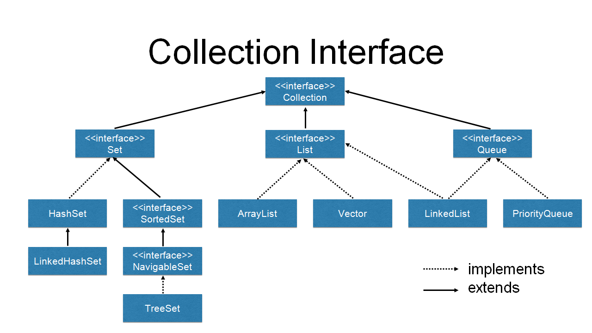

# String

String 为字符串类 在 Java 中是引用类型
底层为 char 数组，所以很多特性都是数组的特性 例如 String 由 length () 方法保存长度
字符串一旦确定 不能修改

## 构造方法

- 字符数组转字符串
  `new String(char[])`
- 字节数组转字符串
  `new String(byte[])`
  - 选取字节数组位置转字符串
    `new String(byte[],index,last)`

## 常用方法

- `indexOf()`
  从头查找某字符的索引 不存在返回 `-1`
- `lastIndexOf()`
  从尾查找某字符的索引 不存在返回 `-1`
- `charAt()`
  获取字符串中索引处的字符
- `trim()`
  去除字符串中两边的空格
- `startsWith()`
  判断是否以指定字符串开头
- `endsWith()`
  判断是否以指定字符串结尾
- `toUpperCase()`
  转大写
- `toLowerCase()`
  转小写
  截取字符串
- `toCharArray()`
  转字符数组
- `getBytes()`
  转字节数组
- `replace()`
  替换
  - `replaceAll()`
    包含正则表达式的替换
- `split()`
  以指定字符串分割为字符串数组
- `equalsIgnoreCase()`
  不区分大小写比较

# StringBuffer/StringBuilder

`StringBuffer`线程安全 多线程环境下不会出现问题
`StringBuilder`线程不安全 多线程环境下可能出现问题

## 常用方法

- `append()`
  字符串拼接
- `capacity()`
  获取容量

# 包装类

装箱 自动将基本数据类型转换为包装器类型
拆箱 自动将包装器类型转换为基本数据类型

| 基本类型 | 封装类型  |
| -------- | --------- |
| byte     | Byte      |
| char     | Character |
| short    | Short     |
| int      | Integer   |
| long     | Long      |
| float    | Float     |
| double   | Double    |
| boolean  | Boolean   |

## 相互转换

## 自动装箱和自动拆箱

## 深入整型常量池

# System

`public static long currentTimeMillis()`
  用来返回当前与 1970 年 1 月 1 日 0 时 0 分 0 秒之间的毫秒时间差

`java.lang`包下的`System`类代表系统，系统级的很多属性和控制方法都放置在该类的内部。
该类的构造器被`private`修饰，所以无法实例化该类同时无法创建该类对象。且内部的成员变量和成员方法都被`static`修饰，所以也可以很方便的进行调用。

## 成员变量

System 类内部包含`in`、`out`和`err`三个成员变量，分别代表标准输入流（键盘输入），标准输出流（显示器）和标准错误输出流（显示器）。

# Throwable



# Error

系统内部错误 这类错误由系统进行处理 程序本身无需处理

- OOM（内存溢出错误）
- VirtualMachineError（虚拟机错误）
- StackOverflowError（堆栈溢出错误）

一般发生这种情况，JVM 会选择终止程序

# Exception

`Exception` 是所有异常类的父类

`printStackTrace()` 打印错误的追踪栈帧
`getMessage()` 获取错误信息

## 分类

- RuntimeException
  指程序编译时需要捕获或处理的异常。属于 checked 异常。如 IOException、自定义异常等
- 非 RuntimeException
  指程序编译时不需要捕获或处理的异常。属于 unchecked 异常。一般是由程序员粗心导致的。如空指针异常、数组越界、类型转换异常等

# try catch

处理异常

1.7 新特性 自动关闭资源

```java
try (资源打开语句;可以写多个) {
  高风险语句;
} catch(异常类型){

}
```

可以写多个`catch` 但是从上到下必须是从子类到父类 或者没有继承关系

# throws

抛出异常  提醒机制

一般在服务端使用`throws`。在客户端使用`try catch`
服务端就是被调用的 客户端就是调用处

# fianlly

必须执行的语句块 不能单独使用 必须和`try` `try...catch...`一同使用

只有在执行`System.exit(0)`后`finally`才不会执行

## 不能有比原方法有更宽泛的异常

方法重写不能比原方法有更宽泛的异常

# 自定义异常

一般需要提供无参构造以及有参构造 用于把异常信息传递给父类

## throw

异常起点

```java

class MyException extends Exception{
  public MyException(){

  }
  public MyException(String msg){
    super(msg);
  }
}

public class Test{
//此处可选择 thorws 也可不 throws 运行时异常
//public static void main(String[] args){
  public static void main(String[] args) throws MyException{
    // 创建异常并结合 throw 抛出
    throw new MyException("自定义消息");
  }
}
```

# Collection

- add()
- addAll()
- remove()
- removeAll()
- clear()
- isEmpty()
- contains()

`contains()` 和 `remove()` 都会调用 `equals()` 方法

如果集合中存放基本数据类型 一定要将其装箱为基本类型包装类
**没有提供修改和查询的方法**



# iterator

迭代器

主要做遍历操作 使用迭代器可以**屏蔽数据结构之间的差异性**

- hasNext()
- next()
- remove()

迭代器一旦生成 集合将不能被修改 否则需要重新生成迭代器

## 增强 for 循环

迭代器的简写方式 同样不能删除

# List

有序 可重复

## ArrayList

底层为 **Object 数组** 查询修改效率高

- add(index,items)
- set(index,items)
- size()

## LinkedList

底层为双向链表 随机添加和删除效率高

链表由节点 (`Node`) 构成 节点存储了三个属性

- 保存的数据 Object
- 上一个节点对象 节点类型
- 下一个节点对象 节点类型

为了首尾添加效率更高，在 LinkedList 类中保存了首节点和尾结点

### 特殊方法

- addFirst()
- offerFirst()
- addLast()
- offerLast()
- removeFirst()

# Set

无序（不保证数据的添加和取出顺序一致）
不可重复（重复后不会再添加）

## TreeSet

底层为`TreeMap`

`TreeMap`底层为红黑树 添加的元素会按照一定格式自动排序

向`TreeMap`中添加的数据都有比较器

因此我们如果要添加没有比较器的对象或者自定义的对象时会出错。另外因为排序需要比较，所以只能添加同类型数据

- 数字 大小升序
- 字符串 每一位 ASCII 码
- Date 自然日期

## HashSet

底层为`HashMap`的`K`部分
`HashMap`底层为散列表

# Comparable

**比较器** 被添加的`TreeSet`元素需要实现 Comparable 接口并重写接口中的`compareTo()`方法
`compareTo()`方法返回值代表排序规则
添加元素时会调用元素对象的`compareTo()`方法把集合中的元素传入进行比较
如果`==0` 说明重复，不添加
如果`<0` 说明要添加的元素小，向前放
如果`>0` 说明要添加的元素大，向后放

```java
import java.util.TreeSet;

public class Tree {
  public static void main(String[] args) {
    TreeSet<Object> tree = new TreeSet<>();
    tree.add(new User("张三",18));
    tree.add(new User("李四",13));
    tree.add(new User("王五",32));
    tree.add(new User("赵六",11));
    System.out.println(tree);
  }
}

class User implements Comparable {
  private String name;
  private int age;

  public User() {
  }

  public User(String name, int age) {
    this.name = name;
    this.age = age;
  }

  public String getName() {
    return name;
  }

  public void setName(String name) {
    this.name = name;
  }

  public int getAge() {
    return age;
  }

  public void setAge(int age) {
    this.age = age;
  }

  @Override
  public String toString() {
    return "User [name=" + name + ", age=" + age + "]";
  }

  @Override
  public int compareTo(Object o) {
    if (o instanceof User) {
      User u = (User) o;
      // this.getAge() - u.getAge() 大于 1 升序排序
      return this.getAge() - u.getAge();
    }
    return 0;
  }
}

```

# Comparator

比较器类 要添加的元素不需要实现这个接口

`Integer`类中有默认升序的比较方法，假如想要降序的时候可以通过实现`Comparator`接口来重新定义排序规则；或者把不能排序的`Object`对象 **（没有实现`Comparable`接口）** 保存在`TreeSet`中时，还是需要`Comparator`来进行比较
当保存的元素不能排序（没有实现`Comparable`接口）或者排序规则不符合我们的需求时均可实现`Comparator`接口并重写`compare()`方法进行排序

*当`Comparator`比较器和`Comparable`比较器同时存在时，`Comparator`优先级高于`Comparable`*

此处体现了**对修改关闭 对扩展开放**

## 与匿名类同时使用

```java
import java.util.Comparator;
import java.util.TreeSet;

@SuppressWarnings("all")
public class UnNamed {
  public static void main(String[] args) {
    // TreeSet<Object> tree = new TreeSet<>(new MyComparator());
    // 匿名类 常用在比较器中
    TreeSet<Object> tree = new TreeSet<>(new Comparator() {
      @Override
      public int compare(Object o1, Object o2) {
        if (o1 instanceof Integer && o2 instanceof Integer) {
          // o1 是要添加的元素
          // System.out.println(o1);
          // o2 是集合中的元素
          // System.out.println(o2);

          Integer i1 = (Integer) o1;
          Integer i2 = (Integer) o2;
          // 10-9 降序排列
          return i2 - i1;
        }
        return 0;
      }
    });
    tree.add(11);
    tree.add(7611);
    tree.add(1);
    tree.add(100);
    tree.add(660);
    tree.add(98);
    System.out.println(tree);
  }
}

class MyComparator implements Comparator {
  @Override
  public int compare(Object o1, Object o2) {
    if (o1 instanceof Integer && o2 instanceof Integer) {
      // o1 是要添加的元素
      // System.out.println(o1);
      // o2 是集合中的元素
      // System.out.println(o2);

      Integer i1 = (Integer) o1;
      Integer i2 = (Integer) o2;
      // 10-9 降序排列
      return i2 - i1;
    }
    return 0;
  }
}
```

# List 排序

`Collections.sort(list)` 排序方法
`void sort(Comparator<? super E> c)`也可传入`Comparator`对象使用`List`的排序方法

# 散列表 / 哈希表

用于存储键值对映射关系 存储方式为数组中保存链表 用于解决哈希冲突问题

链表节点中保存四个属性

# 泛型

类型检查

不使用泛型时集合中可以存储任意类型的数据，且数据均会转型为 Object 类型
缺点：获取时会得到为 Object 类型的数据，使用对象特有属性时需要强制类型转换（向下转型）

使用泛型之后集合中只能保存单一类型的数据
优点：由于保存数据的类型一致，所以使用的时候不需要向下转型
缺点：只能保存单一数据类型
而且传入的泛型类型只能为引用类型不能写基本类型

```java
public class Generic {
	public static void main(String[] args) {
		MyClass myClass = new MyClass();
		myClass.method(1);
		myClass.method("xx");
		MyClass<String> mm = new MyClass<String>();
		mm.m1("xxx");
		// mm.m1(123);
	}
}

// 如果设置泛型后不传入数据类型默认为 Object 类型
class MyClass<T> {
	public void method(T obj) {
		System.out.println(obj);
	}
}
```