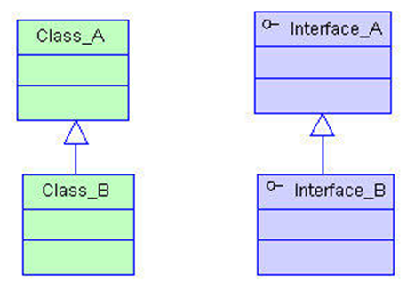
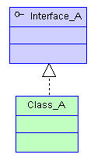
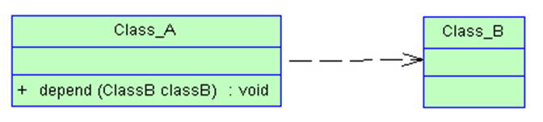
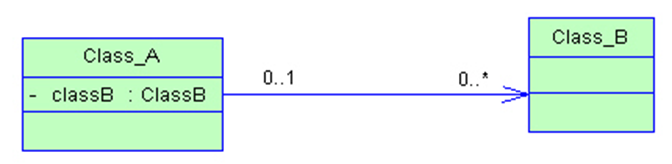
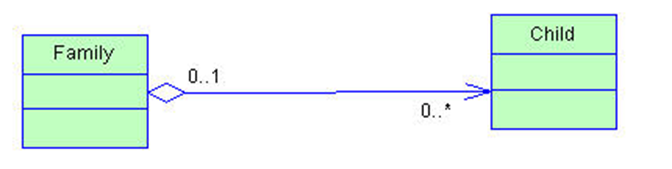
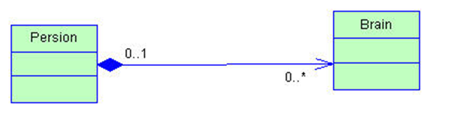

# 面向对象

面向过程：侧重分步骤，考虑完成该功能的过程（自己一步一步干）
侧重分模块（找人分发任务解决任务）

**总结**
面向对象优势：可扩展，可维护，灵活性高，程序耦合度低

面向对象缺点：性能比面向过程相对较差

## 方法特点

+ 静态方法用类名调用，构造方法创建实例化时对象调用，成员方法对象调用
+ 构造方法
  + 声明：权限修饰符 方法名（参数列表）{方法体}; 方法名和类名必须一致
  + 类中没有构造方法，默认有一个无参构造，如果自己编写写但默认的就没有了，一般自己写完构造方法会再写一个无参
+ 只有成员方法才可以直接访问成员属性，静态方法不能访问成员变量（方法只要需要成员变量就定义为成员方法）
+ 成员方法可以访问静态变量

## 类和对象之间的关系
- 类：对事物客观描述的标准
- 对象：一切皆对象，符合类标准的具体个体

## 对象使用

实例化对象：`Student s1 = new Student();`

通过get和set方法获取和设置成员属性

## javaBean

`JavaBean`是一种Java语言写成的可重用组件，它是一个类（类必须是具体的公共的，并且具有无参构造器）

+ 私有化成员变量
+ 对外提供get和set方法
+ get和set方法的作用：
  + 保护成员变量
  + 进行拦截

## 实例化的内存过程
+ 加载客户端类
+ `main`方法压栈
+ 加载服务端类
+ 调用构造方法
+ 在堆内存中开辟空间，对实例化对象初始化
+ 构造方法出栈，实例化对象赋值给变量
## 异常

- 编译时异常
- 运行时异常
  - 空指针异常（用null访问成员变量时）
  - 数组下标越界

## 易错点
+ 区分成员方法和构造方法：看有**无返回值**（构造方法无返回值）
+ 对象可以调用静态变量，`javac`编译时会改成类名调用静态变量（所以空指针也不影响）
+ 静态方法不能调用成员变量

## this

对象中第一个成员变量 保存了当前对象的内存地址 不能出现在静态方法中

### 作用

+ 用在成员方法/构造方法中 区分同名的成员变量和局部变量
+ 重载调用当前类的有参构造方法
  **必须在当前构造方法方法体第一行**
+ 链式调用

## static

修饰符 用来标注静态属性 如果没有使用`static`为成员属性

### 功能

- 静态变量
- 静态方法
- 静态代码块
  不能调用 在程序加载时调用(在`main`方法之前运行) 只执行一次

代码块 无名称方法 自动调用

访问一个类的静态属性的时候 才会加载该类到内存中

实例语句块 可看做无名字成员方法

## 封装

  把所有组成部分组合到一起,还可以通过权限控制修饰符将数据隐藏起来,可以控制用户对类数据的修改程度

  适当的封装可以让代码更容易理解,易于维护,更提高了代码的安全性

### 导包

放在 `package` 之下 `class` 之上

静态导入

导入某个类的某个静态变量

### 权限控制

|    修饰符     | 同一类 | 同包  | 不同类 | 其他  |
| :-----------: | :----: | :---: | :----: | :---: |
|  **private**  |   是   |  否   |   否   |  否   |
|  **default**  |   是   |  是   |   否   |  否   |
| **protected** |   是   |  是   |   是   |  否   |
|  **public**   |   是   |  是   |   是   |  是   |

## 继承

从一个已有的类中 衍生出一个新的类 该类往往包含着父类的特征 还可以新增特有的属性

## 重写

**必须有继承关系**

- 方法名 参数列表 返回值相同
- 不能比原方法有更低的访问权限
- 不能比原方法有更宽泛的异常

### 重写重载区别

### 注解

源码注解

编译注解

运行时注解

## final

可放置在 
- 类
- 变量
- 方法

## 多态

父类引用指向子类对象

- 父类
- 引用 指向的引用数据类型
- 指向 可以找到谁
- 子类对象 创建一个子类的实例化对象

**使用父类创建的引用类型变量 可以找到子类对象**
`父类 变量名 =  new 子类();`

向上转型（由子类转换为父类） 类似于自动转换类型

**非成员方法** 

### 优点

- 降低耦合度 
- 扩展性 替换性 灵活性增强

### 缺点

丢失子类特有的属性 

**成员方法** 如果子类重写了父类的成员方法 则调用子类的成员属性

**非成员方法** 调用父类方法

```java
public class Poly {
    public static void main(String[] args) {
        Sup sub = new Sub();
        // 2
        System.out.println(sub.age);
        sub.m1();
        // Son m2
        sub.m2();
        // sub.m3();
    }
}
class Sup{
    int age = 2;
    public void m1(){
        System.out.println("Father m1");
    }
    public void m2(){
        System.out.println("Father m2");
    }
}
class Sub extends Sup{
    int age = 1;
    public void m2(){
        System.out.println("Son m2");
    }
    public void m3(){
        System.out.println("Son m3");
    }
} 
```

### instanceof

判断某个对象是否由某个类实例化而来

向下转型（由父类转换为子类）

- 直接多态
  `父类 变量名 =  new 子类();`
- 实参形参多态
- 返回值多态
  方法返回值使用父类声明

### 隐蔽多态

通过子类对象 调用继承父类的成员方法是 此时上下文环境为多态环境

```java
public class Poly_05 {
    public static void main(String[] args) {
    // Sup sup = new Sub();
    // // 2 父类
    // System.out.println(sup.age);
    // // 父类 因为子类没有
    // sup.m1();
    // // 子类 因为覆写
    // sup.m2();
    // // 报错,因为父类没有,多态会丢失子类特有属性
    // // sup.m3();
    // // 向下转型
    // Sub sub = (Sub) sup;
    // // 1 子类
    // System.out.println(sub.age);
    // // 父类 继承
    // sub.m1();
    // // 子类 因为子类有
    // sub.m2();
    // // 子类,又没有使用多态
    // sub.m3();

    Sub sub = new Sub();
    sub.m1();
    }
}

class Sup {
    int age = 2;
    public void m1() {
    /**
     * this : 是对象中第一个成员变量,保存当前对象的内存地址
     * 
     * this既然保存当前对象内存地址,那么this的类型 可以是当前类类型,可以是父类类型
     * 
     * this写在哪个类中,哪个类就是当前类 所以 当前类 是Sup 父类 是 Object
     * 
     * 因为this能调用当前类中所有的属性,并没有丢失,所以this是Sup 当前类类型
     * 
     * Sup this;
     * 
     * this : 哪个对象调用这个成员方法,this就指向谁
     * 
     * 最终是Sub调用的m1方法,所以this 指向 Sub
     * 
     * Sup this = Sub;
     */
    
    // System.out.println("父类m1");
    System.out.println(this);
    // 2 父类
    System.out.println(this.age);
    System.out.println(this.sakjdkashdhqwrjnfaksf);
    System.out.println(age);
    // 子类
    m2();
    // 报错
    // m3();
    }

    public void m2() {
    System.out.println("父类m2");
    }
}

class Sub extends Sup {
    int age = 1;

    public void m2() {
    System.out.println("子类m2");
    }

    public void m3() {
    System.out.println("子类m3");
    }
}
```

## abstract

修饰符 用来修饰抽象类和抽象方法

`abstract`修饰的类是抽象类 并且抽象类不能创建对象 而且抽象类一般主要用于**被继承**

`abstract`修饰的方法是抽象方法 该方法没有方法体 不实现功能 用于让不同的子类实现方法

抽象方法必须在抽象类中 而抽象类中可以存在普通方法

抽象类中可看作特殊的类 只不过不能创建对象

**`abstract`和`final`不能同时出现**

- 子类如果继承了抽象类 那么需要实现所有的抽象方法 否则该子类就需要使用abstract修饰
- 抽象类继承抽象类,需要实现0~N个抽象方法
- 普通类继承抽象类需要实现所有方法

## interface

接口关键字

1.8之前 接口是完全抽象的 只允许出现抽象方法和常量(`psf`)

在接口中 只有常量没有变量 并且`psf`可以省略 且权限控制默认是`public`

抽象方法的`abstract`可以省略

```java
interface A{
  int age = 1;

  // 默认方法
  default void method(){
    System.out.println("默认方法");
  }
}
class B{
  void m(){
    System.out.println(A.age);
  }
}
```

## Object

`Object`是Java提供的根类 所有类都直接或间接继承`Object`

`java.lang.Object` 核心包下的所有类不需要导入

### toString

### equals

`==` 基本类型比较值大小 引用类型比较地址

默认的`equals`比较地址

### finalize

JVM 跨平台 多线程 面向对象 自动垃圾回收

垃圾 没有任何引用指向该对象得时候 该对象成为垃圾对象

垃圾被回收时 自动调用该对象的finalize()方法 是在对象生命结束时候被调用

`System.gc()`程序员可以建议JVM进行垃圾回收

## 类之间关系

- 纵向关系
  - 继承
  - 实现
- 横向关系
  - 依赖
  - 关联
  
整体和局部

组成型整体和局部, 聚堆儿型的整体和局部

### 继承关系/泛化关系
继承指的是一个类（称为子类、子接口）继承另外的一个类（称为父类、父接口）的功能，并可以增加它自己的新功能的能力。在Java中继承关系通过关键字 extends明确标识，在设计时一般没有争议性。在UML类图设计中，继承用一条带空心三角箭头的实线表示，从子类指向父类，或者子接口指向父接口。 
 


### 实现关系

实现指的是一个class类实现interface接口（可以是多个）的功能，实现是类与接口之间最常见的关系。在Java中此类关系通过关键字 implements明确标识，在设计时一般没有争议性。在UML类图设计中，实现用一条带空心三角箭头的虚线表示，从类指向实现的接口。 


### 依赖关系

简单的理解，依赖就是一个类A使用到了另一个类B，而这种使用关系是具有偶然性的、临时性的、非常弱的,方法执行完,这个关系就不存在了,就是临时使用了一下功能，但是类B的变化会影响到类A。比如某人要过河，需要借用一条船，此时人与船之间的关系就是依赖。表现在代码层面，为类B作为参数被类A在某个method方法中使用。在UML类图设计中，依赖关系用由类 A指向类B的带箭头虚线表示。 

在程序的整个流程中(程序的生命周期),某个步骤,某几个有限的步骤,需要另外一个类的功能才能完成

**一个方法中调用了另外一个类**



**说白话:就是一个类的局部变量是另一个类的对象的引用**

### 关联关系

关联体现的是两个类之间语义级别的一种强依赖关系，比如我和我的朋友，这种关系比依赖更强、不存在依赖关系的偶然性、关系也不是临时性的，一般是长期性 的，而且双方的关系一般是平等的。关联可以是单向、双向的。表现在代码层面，为被关联类B以类的属性形式出现在关联类A中，
```java
ClassC cc = new ClassC()
ClassC.staticVar
```
全局变量,就是指他的成员变量,静态变量

也可能是关联类A引用了一个类 型为被关联类B的全局变量。在UML类图设计中，关联关系用由关联类A指向被关联类B的带箭头实线表示，在关联的两端可以标注关联双方的角色和多重性标 记。 



**就是一个类成员变量或者静态变量是另外一个类的引用或者是类对象的引用**
### 聚合关系

聚合是关联关系的一种特例，它体现的是整体与部分的关系，即has-a的关系。此时整体与部分之间是可分离的，它们可以具有各自的生命周期，部分可以属于 多个整体对象，也可以为多个整体对象共享。比如计算机与CPU、公司与员工的关系等，比如一个航母编队包括海空母舰、驱护舰艇、舰载飞机及核动力攻击潜艇 等。表现在代码层面，和关联关系是一致的，只能从语义级别来区分。在UML类图设计中，聚合关系以空心菱形加实线箭头表示。 



**一类中的集合元素是另外一个类的对象的引用**

### 组合关系/合成关系

组合也是关联关系的一种特例，它体现的是一种contains-a的关系，这种关系比聚合更强，也称为强聚合。它同样体现整体与部分间的关系，但此 时整体与部分是不可分的，整体的生命周期结束也就意味着部分的生命周期结束，比如人和人的大脑。表现在代码层面，和关联关系是一致的，只能从语义级别来区 分。在UML类图设计中，组合关系以实心菱形加实线箭头表示。  



**一个类中的集合中的元素是另外一个类对象的引用**

### 总结

对于继承、实现这两种关系没多少疑问，它们体现的是一种类和类、或者类与接口间的**纵向关系**。其他的四种关系体现的是类和类、或者类与接口间的引用、 **横向关系**，是比较难区分的，有很多事物间的关系要想准确定位是很难的。前面也提到，这四种关系都是语义级别的，所以从代码层面并不能完全区分各种关系，但 总的来说，后几种关系所表现的强弱程度依次为：组合>聚合>关联>依赖。

软件开发的流程
	项目->确定需求->设计模块(模型)->编码->测试->交付和部署->后期维护


## 内部类

### 成员内部类

```java
class A{
  class B{

  }
}
```

等同于成员变量 不能有静态声明

内部类可以使用权限控制修饰符

可以访问外部类的私有化(被`private`修饰)属性

成员内部类可以直接访问外部类的所有数据

此时`B`类的全类名为`A$B`

### 静态内部类

```java
class A{
  private int a = 1;
  private static int b = 1;
  static class B{
    int c = 1;
    static int d = 1;
    public void method(){
      // System.out.print(a);
      A aaa = new A();
      System.out.print(aaa.a);
      System.out.print(b);
    }
  }
}
```

- 静态内部类可以等同看作静态变量
- 静态内部类无法直接访问外部类的的成员属性
- 静态内部类可以声明任何数据(静态/成员)
- 创建外部类的对象后可访问外部类的的成员属性

### 局部内部类

- 方法中的类是局部内部类
- 局部内部类可看作局部变量
- 如果通过局部内部类访问外部方法中的局部变量的时候,该变量需要加`final`修饰 1.8后`final`可以省略
- 局部内部类不能使用权限修饰符
- 局部内部类不能有静态声明

```java
class A{
  void method(){
    class B{

    }
  }
}
```
此时`B`类的全类名为`A$1B`

如果内部类名重复 则为外部类类名$2内部类类名

### 匿名内部类

当一个方法的参数需要传入一个类对象时 可以使用匿名内部类

#### 语法

```java
new 实现接口(){
  //匿名内部类类体部分
}
```

实现接口 接口没有构造函数所以为空参数

```java
new 父类构造器(实参列表){
  //匿名内部类类体部分
}
```

调用父类构造器可以为空参数 也可以传入参数

#### 示例

```java
//接口部分
interface Product{
  public double getPrice();
  public String  getName();
}

public class Anonymous{
  public void test (Product p){
      System.out.println(p.getName()+"--------"+p.getPrice());
  }
  public static void main(String[] args ){
    Anonymous as = new Anonymous();
    //此处实现接口并实现抽象方法
    as.test(new Product(){
      //实现方法
      public double getPrice( ){
        return 8888;
      }
      //实现方法
      public String getName(){
        return "I can do it ";
      }
    });
  }
}
```
上面代码很简单，就是定义了一个类`Anonymous`，在类里定义了一个`test`方法。然后就是创建Anonymous对象，调用他的实例方法test()
不过调用`test()`方法时，要传入一个`Product`对象。但是由于`Product`是一个接口，无法创建对象，所以要实现该接口。因此此处采用匿名内部类的方式进行，并实现接口中全部的抽象方法


#### 作用

无需通过实现接口或者继承抽象类的方式来实现。但是使用匿名内部类的优点是显而易见的，可以少些代码，而且代码更加简洁

## 设计模式

前人栽树后人乘凉

### 单例模式

让某个类只创建一个对象

#### 饿汉模式

+ 构造方法私有化 因为创建对象使用构造方法 所以可以通过限制构造方法的使用来限制对象的创建

#### 懒汉模式