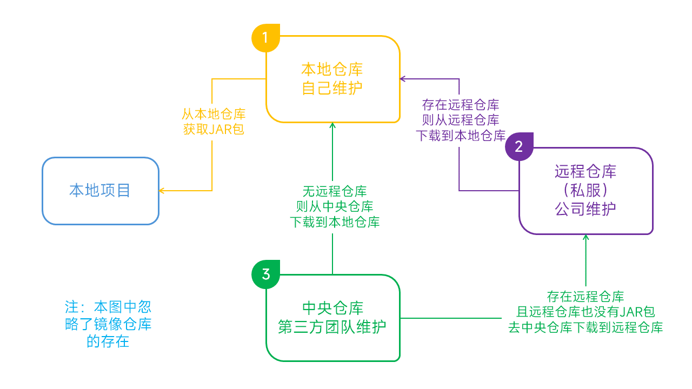

# Maven

# 背景

我们整个软件生命周期基本划分为：需求（业务提需求、产品写文档、技术定排期），开发（需求分析，数据库设计，编码，也包括单元测试等自测），测试，打包对外发布，版本更新（根据时间与业务需求变化又开始重复之前的开发测试等过程）。
项目自动化构建
Maven(pom.xml)。基于Java开发，但是功能更全面更强大，通过修改相关配置文件（pom.xml），自动化支持软件生命周期的几乎所有过程（编译、测试、打包发布、安装）,还有一个比较强大的一个功能：JAR 包依赖功能。

# 命令

- mvn clean
  清理 删除以前的编译结果，为重新编译做好准备
- mvn compile
  编译 将Java 源程序编译为字节码文件
- mvn test
  测试 针对项目中的关键点进行测试，确保项目在迭代开发过程中关键点的正确性
- 报告（）：在每一次测试后以标准的格式记录和展示测试结果
- mvn package
  将一个包含诸多文件的工程封装为一个压缩文件用于安装或部署。Java 工程对应 `jar` 包，Web工程对应 `war` 包。
- mvn install
  安装 在 Maven 环境下特指将打包的结果—— `jar` 包或 `war` 包安装到本地仓库中。
- mvn deploy
  部署 将打包的结果部署到远程仓库或将 `war` 包部署到服务器上运行

mvn -version/-v
显示版本信息

建议在每个操作前先进行 mvn clean 删除，只执行mvn clean会删除target目录 **（存疑？）**。
Maven命令执行时有个特点，它会把之前的过程先执行完毕。比如：
在执行mvn clean package 时，但它实际上是先执行了mvn clean compile，再执行test，再执行package。

# 核心概念

Maven 能够实现自动化构建是和它的内部原理分不开的，这里我们从 Maven 的九个核心概念入手， 看看 Maven 是如何实现自动化构建的

- POM
- 约定的目录结构
- 坐标
- 依赖管理
- 仓库管理
- 生命周期
- 插件和目标
- 继承
- 聚合

Maven 的核心程序中仅仅定义了抽象的生命周期，而具体的操作则是由 Maven 的插件来完成的。可是 Maven 的插件并不包含在 Maven 的核心程序中，在首次使用时需要联网下载。 下载得到的插件会被保存到本地仓库中。本地仓库默认的位置是：`~/.m2/repository`。

## POM

**Project Object Model：项目对象模型。**将 Java 工程的相关信息封装为对象作为便于操作和管理的模型。

```xml
<?xml version="1.0" encoding="UTF-8"?>
<project xmlns="http://maven.apache.org/POM/4.0.0"
         xmlns:xsi="http://www.w3.org/2001/XMLSchema-instance"
         xsi:schemaLocation="http://maven.apache.org/POM/4.0.0 http://maven.apache.org/xsd/maven-4.0.0.xsd">
    <modelVersion>4.0.0</modelVersion>

    <groupId>com.example</groupId>
    <artifactId>demo</artifactId>
    <version>1.0-SNAPSHOT</version>
    <name>demo</name>
    <packaging>war</packaging>

    <properties>
    </properties>

    <dependencies>    
    </dependencies>

    <build>
        <plugins>
        </plugins>
    </build>
</project>
```

## 坐标

Maven 工程的核心配置。

G-A-V：使用三个向量子仓库中唯一定位一个 Maven 工程
1. groupid：公司或组织域名倒序 
2. artifactid：模块名，也是实际项目的名称
3. version：当前项目的版本

```xml
  <groupId>ink.onei</groupId>
  <artifactId>Hello</artifactId>
  <version>0.0.1-SNAPSHOT</version>
```

**如何通过坐标到仓库中查找包？**

- 将 gav 三个向量连起来
  `ink.onei+Hello+0.0.1-SNAPSHOT`
- 以连起来的字符串作为目录结构到仓库中查找
  `ink/onei/0.0.1-SNAPSHOT/Hello-0.0.1-SNAPSHOT.jar`

**注意**：我们自己的 Maven 工程必须执行安装操作才会进入仓库。安装的命令是：`mvn install`

## 结构

Java开发领域普遍认同的一个观点：**约定>配置>编码**（能用配置解决的问题就不编码，能基于约定的就不配置）

Maven 项目目录

```console
项目根目录         工程名作为根目录
├─src              源码目录
│  ├─main          主程序目录
│  │  ├─java       主程序的Java源文件目录
│  │  │
│  │  └─resources  主程序的资源文件目录
│  │
│  └─test          测试程序目录
│      ├─java      测试程序目录
│      │
│      └─resources 测试程序的资源文件目录
└─target           编译结构                              
    ├─classes
    │
    └─generated-sources
        └─annotations
```

## 依赖

Maven 中最关键的部分，我们使用 Maven 最主要的就是使用它的依赖管理功能。要理解和掌握 Maven 的依赖管理，我们只需要解决以下几个问题：

### 依赖的目的是什么

当 A 包用到了 B 包中的某些类时，A 就对 B 产生了依赖，这是概念上的描述。那么如何在项目中以依赖的方式引入一个我们需要的包呢？ 答案非常简单，就是使用 `dependency` 标签指定被依赖包的坐标就可以了。
```xml
<dependency>
  <groupId>ink.onei</groupId>
  <artifactId>Hello</artifactId>
  <version>0.0.1-SNAPSHOT</version>
  <scope>compile</scope>            
</dependency>
```

### 依赖的范围

有时依赖信息中除了目标包的坐标还有一个 scope 设置，这就是依赖的范围。依赖的范围有几个可选值，常用的有：`compile`、`test`、`provided` 三个，当然还有不常用的 `runtime`、`system`...
- compile：默认范围，编译测试运行都有效
- provided：在编译和测试时有效
- runtime：在测试和运行时有效
- test：只在测试时有效
- system：在编译和测试时有效，与本机系统关联，可移植性差

**常用依赖范围有效性总结**

|          | compile | test  | provided |
| -------- | :-----: | :---: | :------: |
| 主程序   |    ✔️    |   ❌   |    ✔️     |
| 测试程序 |    ✔️    |   ✔️   |    ✔️     |
| 参与部署 |    ✔️    |   ❌   |    ❌     |

### 依赖的传递性

A 依赖 B，B 依赖 C，A 能否使用 C 呢？那要看 B 依赖 C 的范围是不是 compile，如果是则可用，否则不可用。

###  依赖的排除

如果我们在当前工程中引入了一个依赖是 A，而 A 又依赖了 B，那么 Maven 会自动将 A 依赖的 B 引入当前工程，但是个别情况下 B 有可能是一个不稳定版，或对当前工程有不良影响。这时我们可以在引入 A 的时候将 B 排除。
```xml
<dependency>
    <groupId>ink.onei</groupId>
    <artifactId>Hello</artifactId>
    <version>0.0.1-SNAPSHOT</version>
    <scope>compile</scope>
    <exclusions>
        <exclusion>
            <groupId>commons-logging</groupId>
            <artifactId>commons-logging</artifactId>
            </exclusion>
    </exclusions>
</dependency>
```

### 统一管理所依赖版本
统一管理所依赖包的版本，对同一个框架的一组包最好使用相同的版本。为了方便升级框架，可以将包的版本信息统一提取出来


- 统一声明版本号
  ```xml
  <properties>
      <starfish.spring.version>4.1.1.RELEASE</starfish.spring.version>
      <project.build.sourceEncoding>UTF-8</project.build.sourceEncoding>
  </properties>
  ```
- 引用前面声明的版本号
  ```xml
  <dependency>
    <groupId>org.springframework</groupId>
    <artifactId>spring-core</artifactId>
    <version>${starfish.spring.version}</version>
    <scope>compile</scope>
  </dependency>
  ```

### 依赖的原则

解决包冲突

- 路径最短者优先
- 路径相同时先声明者优先

## 仓库管理

- 本地仓库
  为当前本机电脑上的所有 Maven 工程服务
- 远程仓库
  - 中央仓库 这是默认的仓库
    架设在 Internet 上，为全世界所有 Maven 工程服务
  - 镜像仓库 通过 `sttings.xml` 中的 `settings.mirrors.mirror` 配置
    架设在各个大洲，为中央仓库分担流量。减轻中央仓库的压力，同时更快的响应用户请求 例如阿里云镜像仓库
  - 私服
    架设在当前局域网环境下，为当前局域网范围内的所有 Maven 工程服务

仓库中的文件

- Maven 的插件
- 我们自己开发的项目的模块
- 第三方框架或工具的包

**不管是什么样的包，在仓库中都是按照坐标生成目录结构，所以可以通过统一的方式查询或依赖**

### 其他仓库

全局profile仓库，通过 `settings.xml` 中的 `settings.repositories.repository` 配置
项目仓库，通过 `pom.xml` 中的 `project.repositories.repository` 配置
项目profile仓库，通过 `pom.xml` 中的 `project.profiles.profile.repositories.repository` 配置



## 生命周期

### 什么是 Maven 的生命周期

Maven 生命周期定义了各个构建环节的执行顺序，有了这个清单，Maven 就可以自动化的执行构建命令了。

Maven 有三套相互独立的生命周期，分别是：

- **Clean Lifecycle** 在进行真正的构建之前进行一些清理工作
- **Default Lifecycle** 构建的核心部分，编译，测试，打包，安装，部署等等
- **Site Lifecycle** 生成项目报告，站点，发布站点

它们是相互独立的，你可以仅仅调用 clean 来清理工作目录，仅仅调用 site 来生成站点。当然你也可以直接运行 `mvn clean install site` 运行所有这三套生命周期。 每套生命周期都由一组阶段(Phase)组成，我们平时在命令行输入的命令总会对应于一个特定的阶段。比如，运行 `mvn clean`，这个 clean 是 Clean 生命周期的一个阶段。有 Clean 生命周期，也有 clean 阶段。

### Clean 生命周期

Clean 生命周期一共包含了三个阶段：

- **pre-clean** 执行一些需要在 clean 之前完成的工作
- **clean** 移除所有上一次构建生成的文件
- **post-clean** 执行一些需要在 clean 之后立刻完成的工作

### Site 生命周期

- **pre-site** 执行一些需要在生成站点文档之前完成的工作
- **site** 生成项目的站点文档
- **post-site** 执行一些需要在生成站点文档之后完成的工作，并且为部署做准备
- **site-deploy** 将生成的站点文档部署到特定的服务器上 这里经常用到的是 site 阶段和 site-deploy 阶段，用以生成和发布 Maven 站点，这可是 Maven 相当强大 的功能，Manager 比较喜欢，文档及统计数据自动生成，很好看。

### Default 生命周期

Default 生命周期是 Maven 生命周期中最重要的一个，绝大部分工作都发生在这个生命周期中（列出一些重要阶段）

- **validate** 验证工程是否正确，所有需要的资源是否可用。
- **compile** 编译项目的源代码。
- **test** 使用合适的单元测试框架来测试已编译的源代码。这些测试不需要已打包和布署。
- **package** 把已编译的代码打包成可发布的格式，比如 jar、war 等。
- **integration-test** 如有需要，将包处理和发布到一个能够进行集成测试的环境。
- **verify** 运行所有检查，验证包是否有效且达到质量标准。
- **install** 把包安装到maven本地仓库，可以被其他工程作为依赖来使用。
- **deploy** 在集成或者发布环境下执行，将最终版本的包拷贝到远程的repository，使得其他的开发者或者工程可以共享

### 生命周期与自动化构建

**运行任何一个阶段的时候，它前面的所有阶段都会被运行**，例如我们运行 mvn install 的时候，代码会被编译，测试，打包。这就是 Maven 为什么能够自动执行构建过程的各个环节的原因。此外，Maven 的插件机制是完全依赖 Maven 的生命周期的，因此理解生命周期至关重要。

## 插件和目标 

- Maven 的核心仅仅定义了抽象的生命周期，具体的任务都是交由插件完成的
- 每个插件都能实现多个功能，每个功能就是一个插件目标
- Maven 的生命周期与插件目标相互绑定，以完成某个具体的构建任务
  例如：compile 就是插件 `maven-compiler-plugin` 的一个目标；pre-clean 是插件 `maven-clean-plugin` 的一个目标

## 继承

**为什么需要继承机制？**

由于非 `compile` 范围的依赖信息是不能在“依赖链”中传递的，所以有需要的工程只能单独配置

- **创建父工程** 创建父工程和创建一般的 Java 工程操作一致，唯一需要注意的是：打包方式处要设置为 `pom`
- 在子工程中引用父工程，从当前目录到父项目的 `pom.xml` 文件的相对路径


```xml
 <parent>
     <groupId>com.starfish.maven</groupId>
    <artifactId>Parent</artifactId>
    <version>0.0.1-SNAPSHOT</version>
    <!-- 以当前文件为基准的父工程pom.xml文件的相对路径 -->
    <relativePath>../Parent/pom.xml</relativePath>
</parent>
```

此时如果子工程的 `groupId` 和 `version` 如果和父工程重复则可以删除。

- 在父工程中管理依赖 将 Parent 项目中的 `dependencies` 标签，用 `dependencyManagement` 标签括起来
  ```xml
  <dependencyManagement>
    <dependencies>
      <dependency>
        <groupId>junit</groupId>
          <artifactId>junit</artifactId>
          <version>4.9</version>
          <scope>test</scope>
      </dependency>
    </dependencies>
  </dependencyManagement> 
  ```

- 在子项目中重新指定需要的依赖，删除范围和版本号
  ```xml
  <dependency>
    <groupId>junit</groupId>
    <artifactId>junit</artifactId>
  </dependency>
  ```

## 聚合

为什么要使用聚合？

将多个工程拆分为模块后，需要手动逐个安装到仓库后依赖才能够生效。修改源码后也需要逐个手动进行 clean 操作。而使用了聚合之后就可以批量进行 Maven 工程的安装、清理工作。

如何配置聚合？ 在总的聚合工程中使用 modules/module 标签组合，指定模块工程的相对路径即可
```xml
<!-- 配置聚合 -->
<modules>
    <!-- 指定各个子工程的相对路径 -->
    <module>starfish-learn-grpc</module>
    <module>starfish-learn-kafka</module>
    <module>starfish-web-demo</module>
</modules>
```